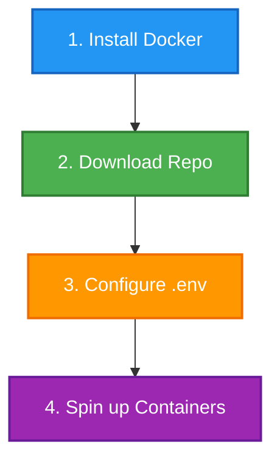

# School Booking Platform 🚀

This repository simplifies running and testing both the backend and frontend services together using Docker. Follow the steps below to get the entire project up and running locally.

---

## 🗺️ Visual Quick Start Guide



---

## 🛠️ Step-by-Step Setup

### **Step 1: Install Docker**

Make sure you have Docker Desktop installed and running on your machine. Download the appropriate version for your OS:

* [🌐 Windows Installation Guide](https://docs.docker.com/desktop/setup/install/windows-install/)
* [🌐 macOS Installation Guide](https://docs.docker.com/desktop/setup/install/mac-install/)
* [🌐 Linux Installation Guide](https://docs.docker.com/desktop/setup/install/linux/)

### **Step 2: Download the Project Code**

Download and extract the latest repository code containing both the frontend and backend:

* [📦 Download Source Code (ZIP)](https://github.com/koder95/school-booking-platform/archive/refs/heads/master.zip)

### **Step 3: Configure Environment Variables**

Navigate to the root directory of the extracted project and set up your environment file:

1. Copy the `.env.sample` file.
2. Save it as `.env`.

> 💡 **Note:** The default values provided in the sample file are pre-configured and ready to use out of the box.

### **Step 4: Run the Application**

Ensure your Docker Desktop application is running, open your terminal in the project's root directory, and execute the following command:

```bash
docker compose up

```

Once the build and startup processes finish, your local development environment will be active.

---

## 🐳 Useful Docker Compose Commands

| Command | Action | Description |
| --- | --- | --- |
| `docker compose up` | **Start & View Logs** | Builds, (re)creates, starts, and attaches to containers for the entire project. |
| `docker compose stop` | **Pause Containers** | Stops running containers without destroying them. |
| `docker compose start` | **Resume Containers** | Starts existing containers that were previously stopped. |
| `docker compose down` | **Stop & Clean** | Stops containers and removes containers, networks, and volumes created by `up`. |

---
